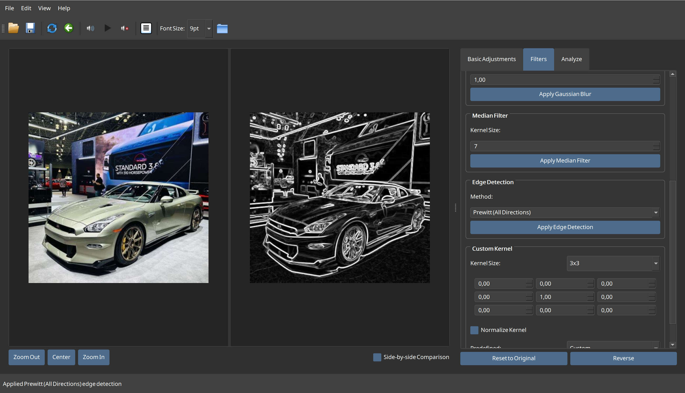

# Photo Editor

A powerful desktop image processing application built with PyQt5 and OpenCV that provides a range of photo editing tools in a user-friendly interface.



## Features

### Basic Adjustments
- **Grayscale Conversion**: Convert images to grayscale using different methods (Luminance, Lightness, Average)
- **Brightness & Contrast**: Fine-tune image brightness and contrast with real-time preview
- **Color Inversion**: Invert all image colors
- **Binarization**: Convert images to binary (black and white) with adjustable threshold

### Filters
- **Sharpness**: Enhance image details with adjustable strength
- **Mean Filter (Box Blur)**: Apply simple box blur with variable kernel size
- **Gaussian Blur**: Apply weighted blur with adjustable kernel size and sigma
- **Median Filter**: Remove noise while preserving edges
- **Edge Detection**: Multiple algorithms for edge detection:
  - Roberts Cross
  - Prewitt (8 directional options)
  - Prewitt (All Directions)
  - Prewitt (Gradient Magnitude)
  - Sobel (8 angular directions: 0°, 45°, 90°, 135°, 180°, 225°, 270°, 315°)
  - Sobel (Gradient Magnitude)
- **Custom Kernel**: Apply your own convolution kernels with predefined templates

### Analysis Tools
- **Histogram**: View image histograms (RGB or grayscale)
- **Projections**: Analyze horizontal and vertical image projections

### UI/UX Features
- **Side-by-side Comparison**: Compare edited image with original
- **Undo/Reverse**: Go back to previous editing steps
- **Zoom Controls**: Zoom in/out and center the image
- **Touch & Gesture Support**: Pinch to zoom, pan with touch or mouse
- **Dark Theme**: Easy on the eyes for extended editing sessions

## Installation

### Prerequisites
- Python 3.6 or higher
- pip (Python package installer)

### Setup

1. Clone the repository:
```bash
git clone https://github.com/yourusername/photo-editor.git
cd photo-editor
```

2. Create a virtual environment (recommended):
```bash
python -m venv venv

# Activate on Windows
venv\Scripts\activate

# Activate on macOS/Linux
source venv/bin/activate
```

3. Install dependencies:
```bash
pip install -r requirements.txt
```

## Usage

### Running the Application

```bash
python photo_editor1.py
```

### Basic Workflow

1. **Open an Image**: File → Open or use the toolbar button
2. **Apply Adjustments**: Use the tabs on the right panel to adjust your image
3. **Save Results**: File → Save or Save As
4. **Undo Mistakes**: Use the Reverse button if you need to go back

### Keyboard Shortcuts

- **Ctrl+O**: Open Image
- **Ctrl+S**: Save Image
- **Ctrl+Shift+S**: Save As
- **Ctrl+Z**: Reverse Last Change
- **Ctrl+R**: Reset to Original
- **Ctrl+=**: Zoom In
- **Ctrl+-**: Zoom Out
- **Ctrl+0**: Center/Reset Zoom
- **Ctrl+D**: Toggle Side-by-side Comparison
- **Ctrl+Q**: Exit Application

### Mouse & Touch Gestures

- **Ctrl+Mouse Wheel**: Zoom in/out
- **Middle-click drag** or **Ctrl+Left-click drag**: Pan image
- **Touchpad pinch**: Zoom in/out (on supported systems)

## Project Structure

- **photo_editor1.py**: Main application file with UI and functionality
- **functions.py**: Core image processing functions
- **requirements.txt**: Project dependencies

## Dependencies

- **PyQt5**: GUI framework
- **OpenCV (cv2)**: Core image processing library
- **NumPy**: Array manipulation for image data
- **Matplotlib**: For histogram and projection visualization

## Core Functions

### Image Processing
The application leverages several key image processing techniques:

- **Convolution Operations**: Used for filters, edge detection, and custom kernels
- **Morphological Operations**: For advanced image manipulation
- **Color Space Transformations**: For grayscale conversion and other adjustments

### Notable Classes

- **PhotoEditor**: Main application window with all UI components
- **CustomScrollArea**: Enhanced scroll area with zoom and pan capabilities
- **CustomImageLabel**: Image display with touch gesture support

## Development

### Adding New Filters

To add a new filter:
1. Add the filter algorithm to `functions.py`
2. Create UI controls in the `create_filters_tab()` method
3. Add an application method in the `PhotoEditor` class

### Custom Kernel Development

Custom kernels can be defined in the application or added to the predefined list in the `apply_predefined_kernel()` method.

## License

[MIT License](LICENSE)

## Authors
- Michał Pytel [@Michael-Pytel](https://github.com/Michael-Pytel)
- Jakub Półtorak [@JakubPoltorak147](https://github.com/JakubPoltorak147)

## Contributing

Contributions are welcome! Please feel free to submit a Pull Request.

1. Fork the repository
2. Create your feature branch (`git checkout -b feature/AmazingFeature`)
3. Commit your changes (`git commit -m 'Add some AmazingFeature'`)
4. Push to the branch (`git push origin feature/AmazingFeature`)
5. Open a Pull Request
